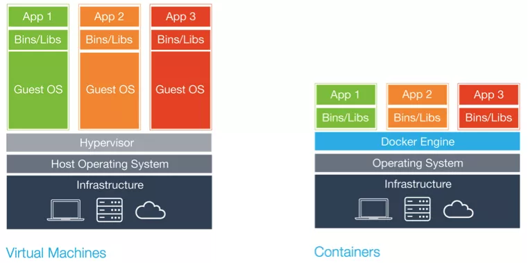
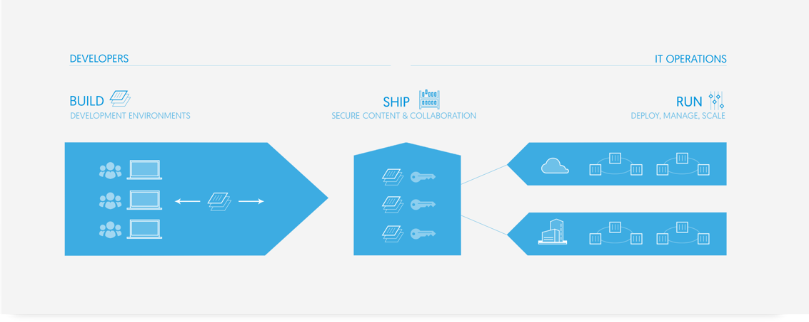
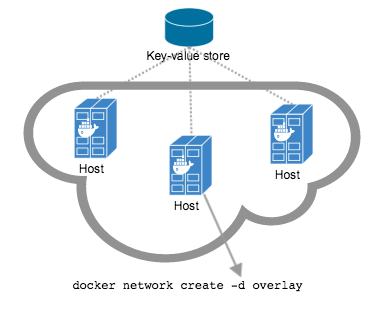
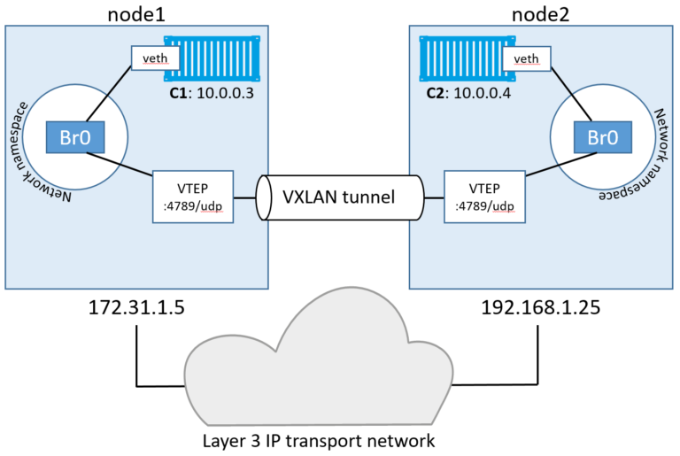
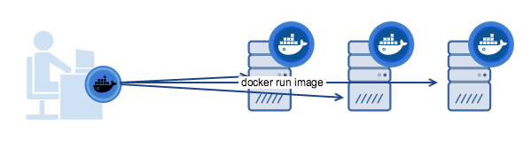
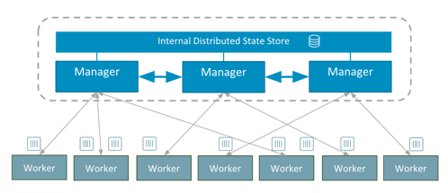
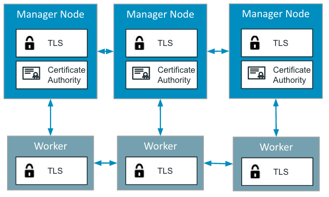

# 0. Introduction

### Container

### Pets vs Cattle

### Docker Container
 - cgroups and namespaces
 - Union file systems
 - go programming language

### Vm vs container


### Build Ship Run


### Advantages of running docker
- Rapid application deployment (infra as code) + testing
- Portability across machines (hardware agnostic )
- Version control and component reuse (tag , layers)
- Sharing (registry)
- Lightweight footprint and minimal overhead
- Simplified maintenance ( immutable infrastructure )


### Drawbacks

- Be aware of security
- Don't use it for monolitic application
- You should respect some best practices (https://github.com/docker/labs/tree/master/12factor)

# 1. Installing docker
```
apt-get update
apt-get install -y apt-transport-https ca-certificates linux-image-extra-$(uname -r) linux-image-extra-virtual
apt-key adv --keyserver hkp://p80.pool.sks-keyservers.net:80 --recv-keys 58118E89F3A912897C070ADBF76221572C52609D
echo "deb https://apt.dockerproject.org/repo ubuntu-xenial main" | sudo tee /etc/apt/sources.list.d/docker.list
apt-get update
apt-get install -y docker-engine
service docker start
usermod -aG docker ubuntu
```
# 2. Introduction to images
```
differences bw images and containers

hub docker +
docker search

official images

tags
```
# 3. Managing containers
```
--help

docker run hello-world
docker --version
pull
run
exec
inspect
rm
ps
stats
logs
```
# 4. Building images

### Images and layers


### Dockerfile
Docker can build images automatically by reading the instructions from a Dockerfile
```
docker build -t shykes/myapp .
```
Instructions:
- FROM
- MAINTAINER
- RUN
- ADD
- ENV
- EXPOSE
- LABEL
- USER
- WORKDIR
- VOLUME
- ...

https://github.com/sth35web/demodocker
http://192.168.48.54/
# 5. Distributing images
```
docker import /export
public/private registry
docker tag
docker push / pull
docker rmi
```
# 6. Volumes 
```
docker run -d -p 80:80 -v /home/ubuntu/demo/demo:/usr/share/nginx/html/demo  --name nginxsth nginxsth:latest

docker volume create --name nginxhtml

run -d -p 80:80 -v nginxhtml:/usr/share/nginx/html/demo  --name nginxsth nginxsth:latest

echo toto > /var/lib/docker/volumes/nginxhtml/_data/index.html
```
https://docs.docker.com/engine/userguide/storagedriver/images/driver-pros-cons.png

# 7. Networking

### Port mapping

Default:
- Containers can make connections to the outside world
- Outside world cannot connect to containers

Mapping:
- To accept incoming connections, specify option -P or -p IP:host_port:container_port in 'run' command
- iptables -t nat -L -n

### DNS

Embedded DNS
- Docker uses embedded DNS to provide service discovery for containers (127.0.0.11:53)
- Key/value store in Docker Engine
- Embedded DNS is network-scoped (Containers not on the same network cannot resolve each other's addresses)

### Bridging
```
docker network ls
docker network inspect bridge

docker exec -ti nginxsth bash
  ping 172.17.0.4 => ok
```  


```
docker network create --driver bridge isolated_nw
docker run -d -P --network=isolated_nw nginxsth:latest
docker network inspect isolated_nw
docker exec -ti fb82aad80f58 bash
  ping 172.18.0.2 => ok
  ping reverent_ramanujan => KO


docker run -d -P --network=isolated_nw --name c1  nginxsth:latest
docker run -d -P --network=isolated_nw --name c2  nginxsth:latest
docker exec -ti c1 bash
  ping c2 => ok
```  


```
#exemple d'isolation :

docker network create --driver bridge front
docker network create --driver bridge back

docker run -d --net=front --name web  nginxsth
docker run -d --net=front --name proxy  nginxsth
docker network connect back proxy
docker run -d --net=back  --name app  nginxsth

```
# 8. Registry

```
docker run -d -p 5000:5000 \
 --restart=always \
 --name registry  \ 
 -e REGISTRY_STORAGE=swift \ 
 -e REGISTRY_STORAGE_SWIFT_USERNAME=xxxxxxxxxxxx \  
 -e REGISTRY_STORAGE_SWIFT_PASSWORD=xxxxxxxx \  
 -e REGISTRY_STORAGE_SWIFT_AUTHURL=http://xxxxxxxxxxxxxxxxxx \  
 -e REGISTRY_STORAGE_SWIFT_CONTAINER=docker \  
 -v  /home/ubuntu/registry/ca:/etc/ssl/certs/ \ 
 registry:2

docker push 192.168.48.54:5000/google/cadvisor

api
authentification
notifications

portus
```
# 9. Continuous Integration

### Github -> dockerhub
https://github.com/sth35web/formationdocker/blob/master/Dockerfile
https://hub.docker.com/r/sth35web/formationdocker/builds/

### Gitlab CI
GitLab CI in conjunction with GitLab Runner can use Docker Engine to test and build any application.

# 10. Multihost networking

### Overlay outside swarm mode

- Requires a valid key-value store service
- Consul, Etcd, and ZooKeeper
- Configure docker engines to use the key-value store



### Overlay in swarm mode

- Embedded key-value store

### Overlay VXLAN



### Plugins
Nuage, Contrail, Midokura, etc...

### More in chapter "Swarm mode"

# 11. Docker machine

Docker Machine enables you to 
- Provision and manage multiple remote Docker hosts
- Provision Swarm clusters



Docker machine
- Automatically creates hosts
- Installs Docker Engine on them
- Configures the docker clients (~/.docker)

Driver:
- AWS (ok) 
- Openstack (ok)
- Virtualbox (ok)
- Azure
- Google Compute Engine
- VMware
- ...

Demo !

```
curl -L https://github.com/docker/machine/releases/download/v0.8.2/docker-machine-`uname -s`-`uname -m` >/usr/local/bin/docker-machine && \
chmod +x /usr/local/bin/docker-machine

```
```
userkeyname=dockerkey
myname=sth
 
for instance in 1 2 3; do
 docker-machine create --driver openstack \
  --openstack-username xxxx \
  --openstack-password xxxx \
  --openstack-tenant-name docker \
  --openstack-auth-url https://xxx:xxx/vxx \
  --openstack-flavor-name m1.large \
  --openstack-image-name Ubuntu-16.04 \
  --openstack-ssh-user ubuntu \
  --openstack-sec-groups default,docker \
  --openstack-keypair-name $userkeyname \
  --openstack-private-key-file .ssh/id_rsa \
  docker$myname-node-$instance
done
```


# 12. Docker compose

Compose:
- Tool for defining and running multi-container Docker applications
- Create and start all the services from your configuration

### Installation
```
curl -L "https://github.com/docker/compose/releases/download/1.8.1/docker-compose-$(uname -s)-$(uname -m)" -o /usr/local/bin/docker-compose
chmod +x /usr/local/bin/docker-compose
```

### Demo
- Install wordpress
- Install graylog 

wordpress
```
version: '2'

services:
   db:
     image: mysql:5.7
     volumes:
       - db_data:/var/lib/mysql
     restart: always
     environment:
       MYSQL_ROOT_PASSWORD: wordpress
       MYSQL_DATABASE: wordpress
       MYSQL_USER: wordpress
       MYSQL_PASSWORD: wordpress

   wordpress:
     depends_on:
       - db
     image: wordpress:latest
     ports:
       - "80:80"
     restart: always
     environment:
       WORDPRESS_DB_HOST: db:3306
       WORDPRESS_DB_PASSWORD: wordpress
volumes:
    db_data:
```

graylog
```
version: '2'
services:
  my-mongo:
    image: "mongo:3"
    volumes:
      - mongo_data:/data/db
  my-elasticsearch:
    image: "elasticsearch:2"
    command: "elasticsearch -Des.cluster.name='graylog'"
    volumes:
      - es_data:/usr/share/elasticsearch/data
  graylog:
    image: graylog2/server:2.1.1-1
    environment:
      GRAYLOG_PASSWORD_SECRET: somepasswordpepper
      GRAYLOG_ROOT_PASSWORD_SHA2: 8c6976e5b5410415bde908bd4dee15dfb167a9c873fc4bb8a81f6f2ab448a918
      GRAYLOG_WEB_ENDPOINT_URI: http://192.168.48.54:9000/api
    links:
      - my-mongo:mongo
      - my-elasticsearch:elasticsearch
    ports:
      - "9000:9000"
      - "12201/udp:12201/udp"
      - "1514/udp:1514/udp"
volumes:
    mongo_data:
    es_data:

```

- docker-compose -f ./wordpress/docker-compose.yml -f ./graylog/docker-compose.yml  up -d
- docker-compose ps
- docker-compose scale db=2
- docker-compose down
- ...


# 13. Docker Swarm

(v1.12)

Manage a cluster of Docker Engines
- Scaling
- State reconciliation
- Multi-host networking
- Service discovery
- Load balancing
- Rolling updates
- ...

```
docker swarm init
docker swarm join \
     --token SWMTKN-1-454us0bn2gra0vqonrqqq1e0v7v2eu39u7cl3bj69lycdw2k04-cuxrhzwwdctr5yl6ikslp0kxe \
     192.168.48.215:2377
docker node promote dockersth-node-1
```



### Scheduling

#### Strategies
- spread
- binpack
- random

#### Filters
- node constraint filter
  - node name
  - label
  - storage driver 
  - etc
- container filters
  - affinity
  - label
  - etc

### Encryption

#### Control plane

- A CA is created with swarm init on the manager nodes
- All communication is encrypted over TLS.
- The node keys and certificates are automatically renewed (default 90 days)



#### Data plane

IPSEC tunnels with AES algorithm between nodes. Keys are automatically roteted by managers every 12 hours.
```
docker network create --opt encrypted --driver overlay my-multi-host-network
```

### Load balancing

The new Docker Swarm mode introduced in 1.12 comes with a native internal and external load balancing functionalities that utilize both iptables and ipvs

#### Internal Load Balancing

2 options (--endpoint-mode )
- DNS RR
- IPVS
##### DNS
 The Docker DNS server resolves a service name to individual container IPs in round robin fashion

##### IPVS
When services are created in a Docker Swarm cluster, they are automatically assigned a Virtual IP (VIP) that is part of the service's network.
```
$ docker service inspect myservice
...

"VirtualIPs": [
                {
                    "NetworkID": "a59umzkdj2r0ua7x8jxd84dhr",
                    "Addr": "10.0.0.3/24"
                },
]
```

#### External Load Balancing (Docker Routing Mesh)

You can expose services externally by using the --publish flag when creating or updating the service. Publishing ports in Docker Swarm mode means that every node in your cluster will be listening on that port.


### Secrets management (v1.13)

### Stack file (v1.13)

### Demo
- Create a galera cluster
- Create a wordpress service
- Check galera and wordpress :
    - auto healing
    - scaling
    - internal and external load balancing


# 14. Security

SANS Institute checklist:
- Ensure good host security
- Check Image Provenance
- Monitor Containers
- Do Not Run Container Processes as Root
- Do Not Store Secrets in Containers
- Base Image Security
- Limit container resources

https://www.sans.org/reading-room/whitepapers/auditing/checklist-audit-docker-containers-37437
